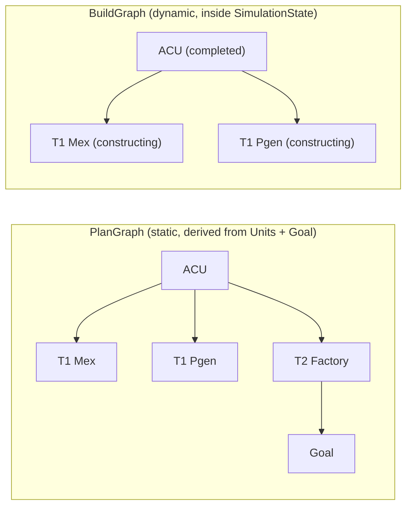
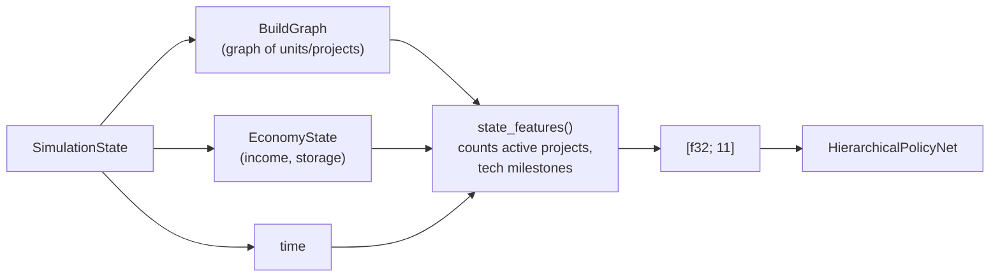

# 2. Modeling the Environment

In RL, every decision is made from a **state**. For FAF build-order optimization, the state is the simulator's `SimulationState`. This chapter explains the structure of that state and how we turn it into a fixed-size feature vector that a Burn network can consume.

For the full formal model — exact definitions, constraints, and assumptions — see [`model.md`](./model.md). This chapter focuses on the RL-relevant view.

## From ACU to goal

The simulator starts with a single completed unit: the ACU (Armored Command Unit). Every other unit is built by assigning builders from the existing graph. The goal itself is not a unit node; it is an abstract target represented by `{ tech_level, mass_cost, energy_cost, build_time }`. The state therefore records:

- every unit that exists,
- when each unit started and finished,
- which builders contributed to which unit,
- the current economy.

Active construction projects are not stored separately; they are the graph nodes currently in the `Constructing` or `Upgrading` state.

```rust
// crates/faf-sim/src/sim/state.rs ~line 317 — SimulationState (abbreviated)
pub struct SimulationState {
    pub time: f64,
    pub graph: BuildGraph,
    pub economy: EconomyState,
    pub events: Vec<BuildEvent>,
}
```

The RL planner does not need to invent this representation; it reuses the existing simulator state as its node payload. It also does not need to read raw FAF data; all unit knowledge comes through the `Units` repository.

## Two graphs: plan graph and build graph

There are two graphs in this system. Keeping them separate prevents the common confusion of thinking the planner adds nodes to the state graph to "estimate" completion time.

| Graph | Lives in | Changes during an episode? | Purpose |
| --- | --- | --- | --- |
| **Plan graph** (`PlanGraph`) | `Units` + `Goal` | No | Static catalogue of every legal build/upgrade edge. Used to enumerate legal actions and to mask network outputs. |
| **Build graph** (`BuildGraph`) | `SimulationState` | Yes | Dynamic record of the actual units and projects in the current game. Grows naturally as the simulator executes actions. |



The plan graph is the menu of possible actions. The build graph is the plate: it contains only what has actually been ordered. When the simulator executes `SimAction::Build { unit_id: "ueb1103", ... }`, a new node is added to the build graph and construction begins. The plan graph itself never changes.

## Nodes and edges

Each node in the build graph represents one built-unit slot. It stores at least:

- `unit_id`: the current blueprint identifier, e.g., `URL0001` (ACU), `URB0101` (T1 land factory), `URL0402` (Monkeylord).
- `state`: a lifecycle tag that says whether the slot is under construction or finished, and whether it was constructed from scratch or upgraded from another unit.

A directed edge `A -> B` means unit `A` contributed build power to create unit `B`. Multiple incoming edges mean multiple builders assisted.

The initial graph contains exactly one node: the ACU, finished at time 0.

## Upgrades add new nodes

An upgrade creates a **new** node for the upgraded unit rather than reusing the old slot. The source node moves to `Replaced { into: new_node }`, so it is no longer counted as an active unit for economy or builder calculations. The new node starts as `Upgrading { from_unit_id: old_id }` and completes as `Upgraded { from_unit_id: old_id }`.

This keeps the graph history explicit: the old unit remains visible as a retired node, while the active unit set contains only the new upgraded unit.

## Builder constraints that shape the tree

Builder behavior creates most of the structure that the planner must reason about:

- A builder works on **exactly one target at a time**. Its build power is indivisible.
- A builder can contribute to many units over its lifetime, but the construction intervals must not overlap.
- To **start** a project, at least one assigned builder must be able to build the target according to the tech graph in `Units`.
- To **upgrade** a unit, the source unit must have a registered upgrade target in `Units.upgrade_table`.
- Other builders may **assist** a project even if they cannot build the target themselves, provided they are real builders (commanders, engineers, factories).
- For every edge `A -> B`: `finish_time(A) <= start_time(B)`.

These rules determine which candidates and `SimAction` expansions are legal from a given state.

## Economy and stall

The state also contains the economy:

- mass income per second,
- energy income per second,
- mass storage and cap,
- energy storage and cap.

When a resource-producing unit finishes, its production is added to the economy state immediately at its `finish_time`.

If available mass or energy cannot sustain the assigned build power, the effective build rate is reduced proportionally to the most-constrained resource. Energy stall is especially punishing because it slows both construction and mass income. A good RL policy will learn to avoid it.

For the current model:

- Energy-dependent systems (shields, radar, stealth) are ignored.
- Reclaim is not modeled.

## Featurizing the state

Neural networks need fixed-size inputs. The state featurizer compresses the variable-size `SimulationState` into an 11-dimensional vector:

```rust
// crates/faf-sim/src/planner/mcts/features.rs ~line 10 — feature constant (excerpt)
/// Number of state features fed into the direction network.
///
/// This is a manual count of the values pushed by `state_features` below.
/// The vector is deliberately small and economy-centric: FAF build orders are
/// driven mainly by income, storage, build power, time, mex saturation, active
/// projects, and the few tech milestones that unlock the goal path.
pub const STATE_FEATURE_COUNT: usize = 11;
```

The 11 features are listed in `state_features`:

```rust
// crates/faf-sim/src/planner/mcts/features.rs ~line 36 — state feature order
// 0. net mass income   (scaled by 100)
// 1. net energy income (scaled by 1000)
// 2. mass storage ratio
// 3. energy storage ratio
// 4. total active build power (scaled by 100)
// 5. simulation time (scaled by 3600 s)
// 6. active mex fraction of cap
// 7. active project count (scaled by 10)
// 8. has T2 factory
// 9. has T3 factory
// 10. has T3 engineer
```

They are intentionally economy-centric. Build orders in FAF are driven mainly by income, build power, and tech tier, so the network gets those directly instead of a huge one-hot unit roster.

The T3 engineer flag is worth calling out: in this model a T3 engineer is the only unit that can start the abstract goal (e.g. a T4 experimental). Without an explicit flag the network would have to infer goal availability from the full unit roster, so the milestone is surfaced as a single boolean.

## What the policy sees

From the network's point of view, a state is a snapshot it can evaluate and expand. **The policy does not consume the build graph as a graph.** It consumes a fixed-size feature vector extracted from the state:



The 11 features are economy-centric numbers and tech booleans, not adjacency lists or node embeddings. This is why the current network is an MLP, not a GNN. The search loop uses the legal successors of this snapshot to grow the tree (see [chapter 4](03-actions-and-successors.md)); the tree itself is the MCTS search tree, not the build graph.

## Why not a GNN?

A graph neural network could consume the build graph directly, but we chose an MLP for two practical reasons:

1. **The relevant state is small.** Income, storage, build power, and the few tech milestones that unlock the goal chain explain most of the variance in good decisions. An 11-D vector captures them compactly.
2. **Training is cheaper.** MLP forward and backward passes are simple and fast, so we can roll out many more episodes per hour. For this problem the extra capacity of a GNN is not worth the cost.

If the state were much larger — for example if we included unit positions, terrain, or an opponent's army — a GNN or transformer would become attractive. For pure build-order optimization, the featurized MLP is enough.

## Objectives

1. **Primary:** minimize the completion time of the goal.
2. **Secondary:** among plans with the same primary time, maximize mass income per mass invested in economy up to that completion time. This prevents the optimizer from rewarding extra economy built after the goal is already reached.

## Assumptions

- Unit knowledge is provided by `Units`; the tech graph and upgrade table are fixed for a given `Units` instance.
- Build power, production, and drain are known per blueprint.
- The economy evolves deterministically given a schedule.
- A builder's build power is indivisible across concurrent targets.
- There is exactly one goal, represented abstractly by its tech level and resource cost.
