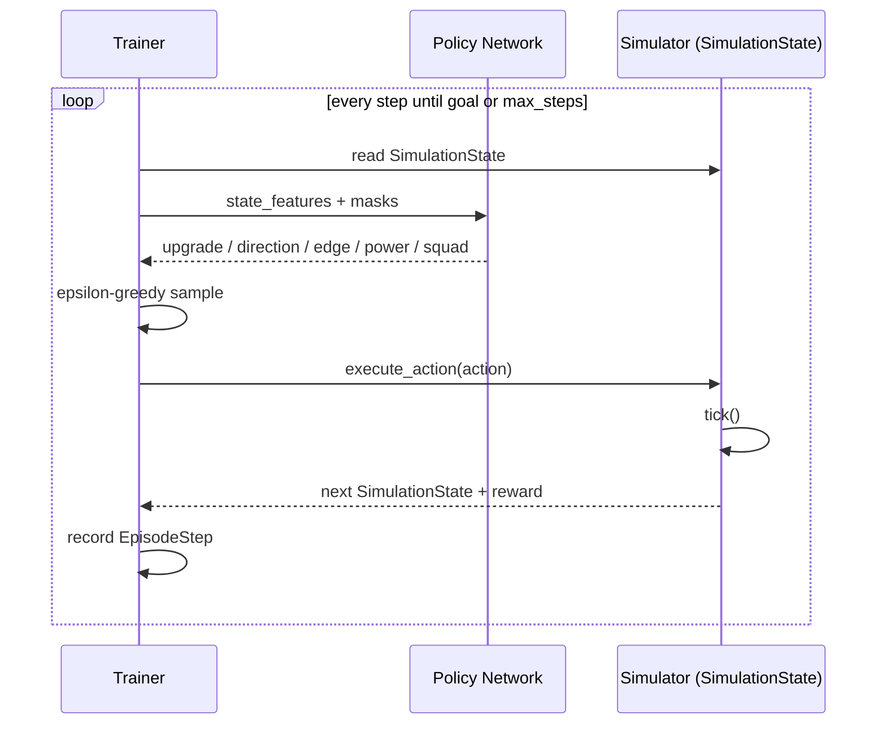
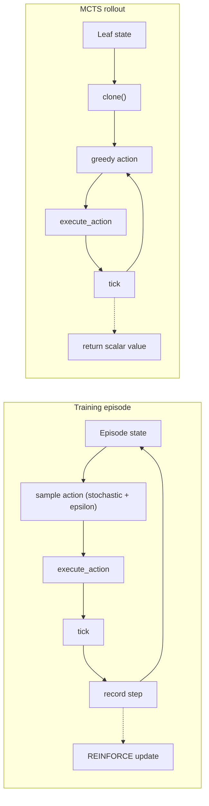

# 6. Training with REINFORCE

This chapter describes how the hierarchical policy is trained. The pipeline uses REINFORCE with epsilon-greedy exploration and entropy regularization, periodically evaluates the policy greedily, and fine-tunes the best discovered trajectory at the end.

**Important:** training does **not** use MCTS. The trainer samples actions directly from the current policy network and rolls out full episodes in the simulator. MCTS is used later, during simulation, to search on top of the trained network.

## Overview

The training entry point is `train_policy`:

```rust
// crates/faf-sim/src/planner/mcts/train/policy.rs ~line 60 — train_policy
pub fn train_policy(
    units: &Units,
    goal: &Goal,
    config: TrainConfig,
    metrics: FafSimMetrics,
    stop_flag: Option<Arc<AtomicBool>>,
    interrupter: Interrupter,
) -> (
    PolicyBundle<TrainBackend>,
    Option<PolicyBundle<TrainBackend>>,
    TrainStats,
) {
    let num_edges = plan_edge_index(units, goal)
        .expect("goal must have a plan graph")
        .len();
    let mut trainer = Trainer::new(config, num_edges)
        .with_metrics(metrics)
        .with_interrupter(interrupter);
    if let Some(flag) = stop_flag {
        trainer.stop_requested = flag;
    }
    let stats = trainer.train(units, goal);
    fine_tune_best_model(trainer, units, goal, &config, stats)
}
```

It returns the final model, an optional best-seen model, and statistics. The optional best model comes from greedy evaluation: whenever the greedy rollout beats the previous best time, the current parameters are stored. After training, the best stored model is fine-tuned on the best trajectory and returned as the final model.

## How training interacts with the simulator

A training episode is a direct interaction between the current policy and the simulator. There is **no MCTS tree** during training. At each step:

1. The trainer observes the current `SimulationState`.
2. It samples an action from the policy network (with epsilon-greedy exploration).
3. It executes that action on the **real episode state** via `execute_action`.
4. The simulator's `tick` advances time, drains resources, and completes projects.
5. The trainer records the transition and reward.



Because `execute_action` and `tick` are the same functions used by MCTS rollouts, the build graph grows the same way during training and during search. The difference is the state object: training advances the **episode state** that survives for the whole episode, while MCTS rollouts advance a **temporary clone** that is discarded after the rollout returns its value.

## Configuration

Training is controlled by `TrainConfig`:

```rust
// crates/faf-sim/src/planner/mcts/train/config.rs ~line 5 — TrainConfig
pub struct TrainConfig {
    /// Number of episodes to run.
    pub episodes: usize,
    /// Maximum simulator steps per episode.
    pub max_steps: usize,
    /// Fixed simulator timestep for rollouts.
    pub dt: f64,
    /// Learning rate for Adam.
    pub learning_rate: f64,
    /// Discount factor for future rewards.
    pub gamma: f32,
    /// Initial probability of taking a random action during training.
    pub epsilon: f32,
    /// Final epsilon value after decay.
    pub epsilon_final: f32,
    /// Number of episodes over which to linearly decay `epsilon`.
    pub epsilon_decay_episodes: usize,
    /// Entropy bonus coefficient.
    pub entropy_coef: f32,
    /// Stop early when the best completion time is at most this many seconds.
    pub target_time: Option<f64>,
    /// Evaluate greedily every N episodes and keep the best model.
    pub greedy_eval_interval: usize,
    /// Stop early if no new best time for this many episodes.
    pub patience: Option<usize>,
    /// Supervised fine-tuning epochs on the best trajectory.
    pub fine_tune_epochs: usize,
    /// Standard deviation for build-power sampling.
    pub power_std: f32,
    /// Standard deviation for engineer-count sampling.
    pub squad_std: f32,
    /// Global gradient norm clipping threshold. `None` disables clipping.
    pub grad_clip: Option<f32>,
}
```

The default configuration is conservative and CPU-friendly:

```rust
// crates/faf-sim/src/planner/mcts/train/config.rs ~line 48 — TrainConfig::default
fn default() -> Self {
    Self {
        episodes: 200,
        max_steps: 500,
        dt: 1.0,
        learning_rate: 1e-3,
        gamma: 0.99,
        epsilon: 0.1,
        epsilon_final: 0.1,
        epsilon_decay_episodes: 0,
        entropy_coef: 0.01,
        target_time: None,
        greedy_eval_interval: 100,
        fine_tune_epochs: 100,
        power_std: 2.0,
        squad_std: 0.5,
        grad_clip: None,
        patience: None,
    }
}
```

You can increase `episodes`, `max_steps`, and the network sizes for harder goals. The default is intended for quick experiments and unit tests.

## Trainer structure

The `Trainer` owns the model, optimizer, and best-seen state:

```rust
// crates/faf-sim/src/planner/mcts/train/trainer/core.rs ~line 21 — Trainer (abbreviated)
pub struct Trainer {
    pub(crate) model: PolicyBundle<TrainBackend>,
    pub(crate) best_model: Option<PolicyBundle<TrainBackend>>,
    pub(crate) best_trajectory: Option<BuildTrajectory>,
    pub(crate) optimizer: AdamOptimizer,
    pub(crate) config: TrainConfig,
    pub(crate) device: TrainDevice,
    pub(crate) rng: ThreadRng,
    pub(crate) metrics: Option<FafSimMetrics>,
    pub(crate) interrupter: Interrupter,
}
```

`Trainer::new` builds a fresh bundle and an Adam optimizer. `Trainer::from_model` continues from an existing bundle, which is useful for resuming training or fine-tuning.

## Episode generation

Each episode rolls out the current policy in the simulator. The trainer gathers a trajectory of recorded steps:

```rust
// crates/faf-sim/src/planner/mcts/train/episode.rs ~line 5 — EpisodeStep
pub(crate) struct EpisodeStep {
    pub(crate) base_features: Vec<f32>,
    pub(crate) direction_mask: Vec<bool>,
    pub(crate) direction_index: usize,
    pub(crate) step_reward: f32,
    pub(crate) return_value: f32,
}
```

At each step the trainer:

1. Featurizes the state.
2. Computes the legal factory-upgrade mask.
3. Samples an upgrade option from the upgrade head (or a random legal upgrade with probability `epsilon`).
4. If no upgrade was chosen, computes the legal direction mask and the legal edge mask for that direction, then samples a direction and edge (again with epsilon-greedy noise).
5. If an upgrade was chosen, resolves it to the corresponding plan-graph upgrade edge.
6. Samples target build power and engineer counts from the power and squad heads, adding Gaussian noise.
7. Resolves the squad into concrete builder nodes and executes the action.
8. Records the step, including the per-step reward and any newly earned milestone bonus.

If the episode exceeds `max_steps` without reaching the goal, it terminates.

## REINFORCE update

After each episode, the trainer calls `update` to perform one gradient step on all recorded steps. The combined loss has three groups:

1. **Discrete policy loss (REINFORCE).** The upgrade, direction, and action log-probabilities are summed and multiplied by the normalized return. This is the policy-gradient term: increase the log-probability of choices that led to high return, decrease it for low-return choices.
2. **Entropy bonus.** The entropy of the discrete heads is subtracted (with coefficient `entropy_coef`) to encourage exploration and prevent premature collapse to a single action.
3. **Continuous negative log-likelihood.** The power and squad heads are trained with maximum-likelihood on the sampled targets. Their negative log-likelihoods are added directly; they are **not** multiplied by the return. Multiplying continuous log-probabilities by the return would reverse their gradients on negative returns and cause the continuous predictions to diverge.

```rust
// crates/faf-sim/src/planner/mcts/train/trainer/update.rs ~line 43 — update (abbreviated)
pub(crate) fn update(&mut self, episode: &Episode) -> f32 {
    for step in &episode.steps {
        // ... build macro input, run latent backbone once ...
        let latent = self.model.latent(macro_input);

        // Upgrade log-prob (always computed; index 0 is "no upgrade").
        let upgrade_logits = self.model.upgrade_logits(latent.clone()).flatten::<1>(0, 1);
        // ... mask, softmax, select sampled index ...
        let upgrade_log_prob = upgrade_log_probs.select(0, upgrade_index_tensor);

        // Direction and action log-probs are only computed when no upgrade was chosen.
        let (direction_log_prob, action_log_prob, direction_entropy, action_entropy) =
            if step.upgrade_index == 0 {
                // ... direction log-prob ...
                // ... action log-prob conditioned on sampled direction ...
                (dir_lp, act_lp, dir_ent, act_ent)
            } else {
                // Zero tensors: no gradient through unused heads on upgrade steps.
                (zero.clone(), zero.clone(), zero.clone(), zero)
            };

        let entropy = direction_entropy + action_entropy + upgrade_entropy;

        // Continuous log-probs for power and squad.
        let power_log_prob = gaussian_log_prob_scalar(power_mean, step.target_power, ...);
        let squad_log_prob = gaussian_log_prob_vec(squad_means, &step.desired_squad, ...);

        // REINFORCE only on discrete decisions.
        let discrete_log_prob = upgrade_log_prob + direction_log_prob + action_log_prob;
        let policy_loss = discrete_log_prob.neg().mul(return_tensor);

        // Continuous heads: maximum likelihood, not weighted by return.
        let continuous_nll = power_log_prob.neg() + squad_log_prob.neg();

        let entropy_loss = entropy.neg().mul_scalar(self.config.entropy_coef);
        let loss = policy_loss + entropy_loss + continuous_nll;

        // ... accumulate loss over the episode ...
    }

    let grads = loss.backward();
    let grads = burn::optim::GradientsParams::from_grads(grads, &self.model);
    self.model = self.optimizer
        .step(self.config.learning_rate.into(), self.model.clone(), grads);
}
```

The discrete heads use `log_softmax` and `.select` to extract the log-probability of the sampled choice. The continuous heads use Gaussian log-probability helpers. Only the discrete choices receive the REINFORCE return signal.

## Greedy evaluation

Every `greedy_eval_interval` episodes, the trainer runs a deterministic greedy rollout with the current parameters. If the greedy rollout reaches the goal faster than any previous greedy rollout, the current model is saved as `best_model`:

```rust
// crates/faf-sim/src/planner/mcts/train/trainer.rs ~line 520 — greedy evaluation
if interval > 0 && ep > 0 && (ep + 1) % interval == 0 {
    if let Some(greedy_time) =
        self.evaluate_greedy(units, goal, &plan, &edge_index, &planner_config)
    {
        let is_new_best = best_time.map_or(true, |t| greedy_time < t);
        if is_new_best {
            best_time = Some(greedy_time);
            episodes_since_best = 0;
            self.best_model = Some(self.model.clone());
            self.best_trajectory = None;
        }
    }
}
```

Greedy evaluation is the source of the best model; REINFORCE alone does not guarantee that the final parameters are the best ones seen.

## Fine-tuning on the best trajectory

After the REINFORCE loop finishes, `fine_tune_best_model` runs supervised fine-tuning on the best trajectory discovered during training. If a best trajectory was recorded from an episode that set a new best time, the trainer creates a fresh optimizer around the best model and minimizes cross-entropy loss on the recorded `direction` targets.

```rust
// crates/faf-sim/src/planner/mcts/train/policy.rs ~line 91 — fine_tune_best_model
fn fine_tune_best_model(
    mut trainer: Trainer,
    units: &Units,
    goal: &Goal,
    config: &TrainConfig,
    stats: TrainStats,
) -> (PolicyBundle<TrainBackend>, Option<PolicyBundle<TrainBackend>>, TrainStats) {
    // ... run fine_tune_epochs of supervised updates on the best trajectory ...
}
```

The function returns the fine-tuned model as the final model. If no trajectory was recorded, it returns the final REINFORCE model and whatever `best_model` was stored.

## Training versus MCTS rollout

Training episodes and MCTS rollouts both advance the simulator, but they serve different purposes and differ in three key ways:

| | Training episode | MCTS rollout |
| --- | --- | --- |
| **State object** | The real episode state, kept for the whole episode. | A clone of the MCTS leaf state, discarded after the rollout. |
| **Action selection** | Stochastic sampling plus epsilon-greedy exploration. | Greedy argmax from the policy network. |
| **Outcome** | A full trajectory used to update network weights. | A single scalar value estimate backed up into the MCTS tree. |
| **Build graph growth** | Same `execute_action` + `tick` path; nodes are added naturally. | Same `execute_action` + `tick` path; nodes are added to the clone. |



The shared simulator path is why the policy trained on episodes can be used directly inside MCTS rollouts: both see the same consequences of every action.

## Saving and loading

Save the full bundle with `save_policy`:

```rust
// crates/faf-sim/src/planner/mcts/train/policy.rs ~line 15 — save_policy
pub fn save_policy(
    model: &PolicyBundle<TrainBackend>,
    path: &std::path::Path,
) -> Result<(), String> {
    if let Some(parent) = path.parent() {
        std::fs::create_dir_all(parent).map_err(|e| format!("failed to create model dir: {e}"))?;
    }
    let recorder = CompactRecorder::new();
    recorder
        .record(model.clone().into_record(), path.to_path_buf())
        .map_err(|e| format!("failed to save model: {e}"))
}
```

Load it with `load_policy`, passing the number of plan-graph edges so the network dimensions can be validated:

```rust
// crates/faf-sim/src/planner/mcts/train/policy.rs ~line 29 — load_policy
pub fn load_policy(
    path: &std::path::Path,
    num_edges: usize,
) -> Result<PolicyBundle<TrainBackend>, String> {
    let device: TrainDevice = Default::default();
    let recorder = CompactRecorder::new();
    let record = recorder
        .load(path.to_path_buf(), &device)
        .map_err(|e| format!("failed to load model: {e}"))?;
    let model = PolicyBundle::new(&device, num_edges).load_record(record);

    if model.num_edges() != num_edges {
        return Err(format!(
            "action head output dimension mismatch: expected {num_edges}, got {}; retrain the model",
            model.num_edges()
        ));
    }

    Ok(model)
}
```

Old `.mpk` models saved before the abstract-goal change will not load; the universal plan graph now has a fixed edge count and a synthetic `Goal` node. Delete old checkpoints and retrain.

## Monitoring progress with Burn's training traits

Training progress is reported through Burn's standard `Metric`, `MetricsRenderer`, and `Interrupter` traits. If you are implementing RL with Burn, follow this pattern instead of inventing your own observer or dashboard code.

Burn splits progress reporting into three responsibilities:

1. **`Metric`** — a pure numeric state machine. It consumes training events and produces a formatted value. It knows nothing about the terminal, files, or network.
2. **`MetricsRenderer`** — a display sink. It receives formatted metric states and renders them (TUI, plain text, remote logger, etc.).
3. **`Interrupter`** — a cooperative stop flag. A renderer can set it; the trainer checks it once per episode and stops cleanly.

This is why the old custom `TrainingObserver`, `verbose` flag, and `faf-sim-tui` crate were removed. The new design keeps measurement, display, and cancellation separate.

### A `Metric` implementation

Each value we care about is a struct that implements `Metric<Input = TrainEvent>`:

```rust
// crates/faf-sim/src/planner/mcts/train/metric/metrics.rs ~line 18 — EpisodeLossMetric
#[derive(Clone, Default)]
pub struct EpisodeLossMetric {
    name: MetricName,
    state: NumericMetricState,
}

impl Metric for EpisodeLossMetric {
    type Input = TrainEvent;

    fn name(&self) -> MetricName {
        self.name.clone()
    }

    fn attributes(&self) -> MetricAttributes {
        NumericAttributes {
            unit: None,
            higher_is_better: false,
        }
        .into()
    }

    fn update(&mut self, item: &Self::Input, _metadata: &MetricMetadata) -> SerializedEntry {
        let value = match item {
            TrainEvent::Episode(EpisodeSummary { loss: Some(l), .. }) => *l as f64,
            _ => return SerializedEntry::new("-".to_string(), "".to_string()),
        };
        self.state.update(
            value,
            1,
            FormatOptions::new(self.name()).precision(4),
        )
    }

    fn clear(&mut self) {
        self.state.reset();
    }
}
```

Because a `Metric` is pure, you can test it in isolation by feeding it a few `TrainEvent` values. You do not need a running simulator, a terminal, or a backend.

### The metric bundle

`FafSimMetrics` owns all metric instances and forwards each event to every metric:

```rust
// crates/faf-sim/src/planner/mcts/train/metric/metrics.rs ~line 582 — FafSimMetrics (abbreviated)
pub struct FafSimMetrics {
    renderer: Box<dyn MetricsRenderer>,
    loss: EpisodeLossMetric,
    steps: EpisodeStepsMetric,
    completion_time: CompletionTimeMetric,
    goal_reach: GoalReachMetric,
    epsilon: EpsilonMetric,
    best_time: BestTimeMetric,
    greedy_time: GreedyEvalTimeMetric,
    speed: EpisodeSpeedMetric,
}
```

At the start of training it registers every metric with the renderer. After each episode it updates every metric and asks the renderer to redraw:

```rust
// crates/faf-sim/src/planner/mcts/train/metric/metrics.rs ~line 614 — register
pub fn register(&mut self) {
    Self::register_metric(&mut *self.renderer, &self.loss);
    Self::register_metric(&mut *self.renderer, &self.steps);
    // ... one line per metric
}

// crates/faf-sim/src/planner/mcts/train/metric/metrics.rs ~line 633 — update
pub fn update(&mut self, event: &TrainEvent, metadata: &MetricMetadata) {
    Self::update_metric(&mut *self.renderer, &mut self.loss, event, metadata);
    // ... one line per metric
}
```

### Emitting events from the training loop

The trainer does not know which renderer is attached. It just emits a `TrainEvent` and calls `render`:

```rust
// crates/faf-sim/src/planner/mcts/train/trainer/loop.rs ~line 149 — episode event dispatch
if let Some(ref mut metrics) = self.metrics {
    let metadata = metric_metadata(ep + 1, self.config.episodes);
    metrics.update(
        &TrainEvent::Episode(EpisodeSummary {
            episode: ep + 1,
            total_episodes: self.config.episodes,
            // ...
        }),
        &metadata,
    );
    metrics.render(training_progress(ep + 1, self.config.episodes, Some(ep + 1)), vec![]);
}
```

### Graceful stop with `Interrupter`

The trainer checks both the SIGINT flag and the Burn `Interrupter` once per episode:

```rust
// crates/faf-sim/src/planner/mcts/train/trainer/core.rs ~line 91 — should_stop
pub(crate) fn should_stop(&self) -> bool {
    self.stop_requested.load(Ordering::Relaxed)
        || self.interrupter.is_stopped()
}
```

If the user closes the TUI or sends SIGINT, the current episode finishes, the best model is fine-tuned, and the checkpoint is saved cleanly.

### Why this matters for RL in Burn

Following these conventions gives four concrete wins:

- **Less code.** The custom `faf-sim-tui` crate and its Ratatui event loop are gone. Burn ships a production-ready TUI renderer.
- **Easier to extend.** Adding a new metric means implementing one `Metric` struct and adding it to the bundle. Every renderer automatically receives the new value.
- **Testable.** Metrics are pure, so you can assert on their numeric output without a running training loop.
- **Better hardware utilization.** The old dashboard did terminal I/O on the training thread. Burn's `TuiMetricsRendererWrapper` runs the UI on its own thread, so the training loop spends almost all of its time on rollouts and gradient steps. The practical sign on this machine was that the GPU/CPU fans stayed at higher, steadier speeds — the backend was no longer waiting for the screen to redraw.

The CLI wiring is covered in the [Integration and CLI](08-integration.md) chapter. Pass `--no-tui` for plain-text output or `--quiet` to suppress live output entirely.

If progress stalls, try:

- Increasing `episodes` or `max_steps`.
- Raising or lowering `learning_rate`.
- Changing `gamma`.
- Adjusting `epsilon` or `entropy_coef`.
- Tuning the reward weights in `train::reward`.

## CLI training

The CLI wraps the programmatic API:

```text
faf-sim train -e 5000 -m 10000 uef novaxcenter
```

This trains a UEF `novaxcenter` bundle with 5000 episodes and up to 10000 steps per episode. Output is written to `data/models/mlp-uef-novax-center`. The same network shape is used for every target because the plan graph is universal; only the synthetic `Goal` node carries target-specific cost and build time.

By default the CLI opens Burn's TUI dashboard when running in an interactive terminal. Use `--no-tui` to keep plain-text output, or `--quiet` to suppress live output entirely:

```text
faf-sim train -e 5000 -m 10000 --no-tui uef novaxcenter
faf-sim train -e 5000 -m 10000 --quiet uef novaxcenter
```

### Early stopping on a plateau

Set `--patience <N>` to stop training if the best completion time has not improved for `N` episodes. Patience is counted only **after the first successful episode**, so the run will keep trying until it finds at least one solution.

```text
faf-sim train -e 10000 -m 5000 --patience 1000 uef novaxcenter
```

This is useful for long training runs: instead of committing to a fixed episode budget, you let the trainer run until it stops making progress. You can combine it with `-t` (`target_time`) to stop as soon as a good enough time is reached.

### Disabling epsilon decay

By default epsilon decays from `--epsilon` to `--epsilon-final` over the run. If you want to keep exploring at a constant rate — for example when resuming from a saved model — pass `--no-epsilon-decay`. Epsilon then stays at the value of `--epsilon` for the whole run:

```text
# constant 10% random actions (default --epsilon)
faf-sim train -e 10000 -m 5000 --no-epsilon-decay uef novaxcenter

# constant 30% random actions
faf-sim train -e 10000 -m 5000 --epsilon 0.3 --no-epsilon-decay uef novaxcenter
```

## Testing

Unit tests for training live in `crates/faf-sim/src/planner/mcts/train/tests.rs`. They cover:

- Episode rollout shape and reward accumulation.
- `find_upgrade_source` helper.
- `assigned_squad_counts` helper.
- Tensor helper functions.
- Saving and loading a round-tripped bundle.

Run them with:

```text
cargo test -p faf-sim
```

There is no end-to-end integration test for a full training run because it is too slow for the normal test suite.
