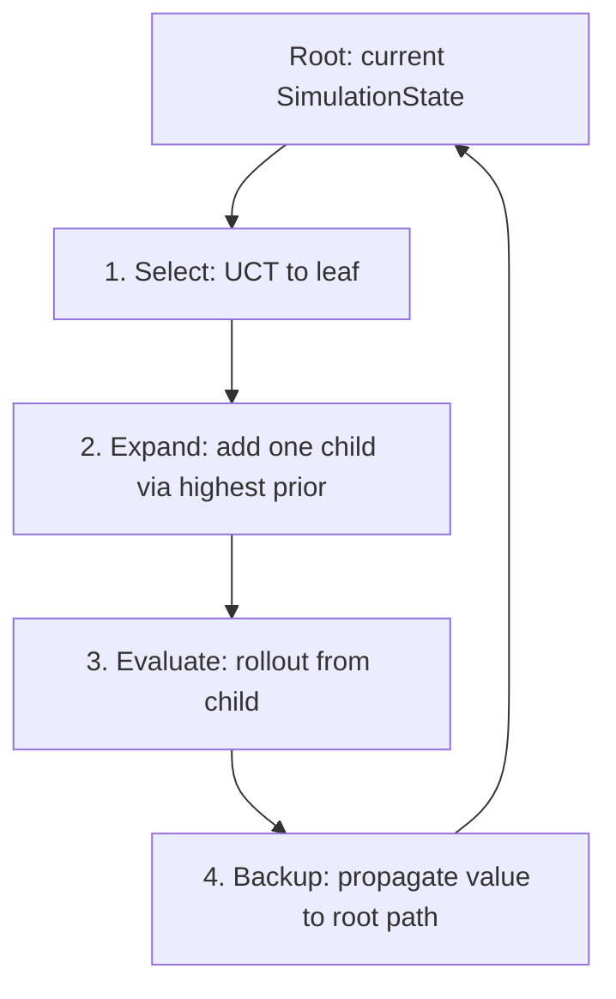
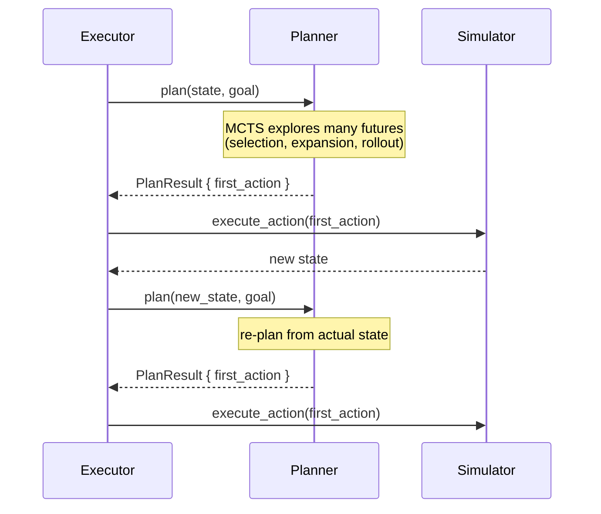
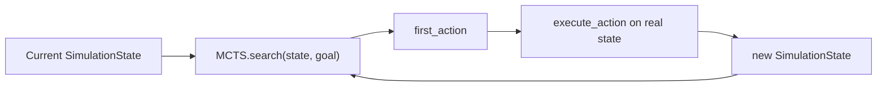

# 7. MCTS Search

This chapter describes the UCT (Upper Confidence Bound applied to Trees) search loop that sits on top of the trained hierarchical policy. The policy provides prior probabilities over plan-graph edges and a default rollout policy; MCTS turns those into a closed-loop planner.

**MCTS is used during simulation, not during training.** Training uses REINFORCE to optimize the policy network directly (see [chapter 7](06-training-pipeline.md)). MCTS is what you run when you call `faf-sim simulate` with a trained model.

## MCTS vs the one-step policy

MCTS is not the only way to use the trained network. The network can act by itself through `macro_policy_plan`, which runs one forward pass and immediately returns a `SimAction`. MCTS is an optional search layer on top of that one-step policy.

The difference is lookahead:

- **One-step policy:** picks the best action for the current state only. Fast, but myopic.
- **MCTS:** simulates many future trajectories, each one using the one-step policy to choose actions, and picks the root action with the best empirical average.

Training uses the one-step policy directly because it is fast enough to run thousands of episodes. The CLI `simulate` command uses MCTS to get stronger play from the same trained weights.

## Search loop

Each MCTS iteration repeats four steps:

1. **Select.** Traverse from the root to a leaf using the UCT formula.
2. **Expand.** Add one child to the leaf using the highest-priority legal plan-graph edge.
3. **Evaluate.** Estimate the value of the new child with a rollout (or use the terminal outcome if the state is done).
4. **Backup.** Add the evaluated value to every node on the path from the new child back to the root.



These four steps are implemented in `MctsSearch::search`:

```rust
// crates/faf-sim/src/planner/mcts/search.rs ~line 115 — MctsSearch::search
pub fn search(
    &self,
    initial_state: SimulationState,
    goal: &Goal,
    units: &Units,
    planner_config: &PlannerConfig,
    model: &dyn ValueNet,
) -> Result<PlanResult, PlannerError> {
    let edge_index = PlanEdgeIndex::new(&units.plan_graph(*goal));
    let mut root = MctsNode::new(
        initial_state,
        goal,
        units,
        planner_config,
        &edge_index,
        model,
    );

    for _ in 0..self.config.iterations {
        let path = select_path(&root, self.config.c_puct);
        // ... walk to leaf, expand or rollout, backup value ...
    }

    // Pick the root child with the highest visit count.
    // ...
}
```

If `iterations` is zero, the loop body is skipped and the search picks the root child with the highest prior probability (because no visits have occurred yet). This is different from the one-step hierarchical policy; if you want the one-step policy, use `mcts::policy::plan` directly with `iterations == 0`.

The final root move is chosen by **visit count**, not by the policy directly. MCTS aggregates the results of many rollouts and picks the action that was explored most often, which is usually the most robust action.

## Node structure

Each MCTS node stores the simulator state at that point in the tree plus statistics:

```rust
// crates/faf-sim/src/planner/mcts/search.rs ~line 47 — MctsNode
struct MctsNode {
    /// Simulator state at this node.
    state: SimulationState,
    /// Total value accumulated from backpropagation.
    total_value: f64,
    /// Number of times this node has been visited.
    visits: usize,
    /// Child nodes, keyed by the plan-graph edge used to reach them.
    children: Vec<(usize, Box<MctsNode>)>,
    /// Legal edges that have not been expanded yet.
    untried_edges: Vec<usize>,
    /// Prior probability for each plan-graph edge (sparse: legal edges only).
    edge_priors: Vec<f32>,
    /// True if the state has reached the goal.
    is_terminal: bool,
}
```

- `state` is the simulator state after applying the edge that leads to this node.
- `total_value` is the sum of all backed-up values.
- `visits` is the number of times the node has been visited.
- `children` maps each expanded edge index to its child node.
- `untried_edges` lists legal edges that have not been expanded yet.
- `edge_priors` stores the network's prior probability for each edge.
- `is_terminal` is true if the state has reached the goal.

## Selection

At each internal node, `select_path` picks the child that maximizes the PUCT formula:

```text
PUCT(child) = (child.total_value / child.visits)
              + c_puct * prior * sqrt(parent.visits) / (1.0 + child.visits)
```

```rust
// crates/faf-sim/src/planner/mcts/search.rs ~line 278 — select_path
fn select_path(node: &MctsNode, c_puct: f64) -> Vec<usize> {
    // ... while not at leaf, pick child with best q + u ...
}
```

The first term is exploitation: children with high average value are preferred. The second term is exploration: children with high prior probability and few visits get a bonus. `c_puct` controls the balance.

A larger `c_puct` makes the search explore more aggressively. A smaller `c_puct` makes it greedier. The right value depends on the noise in your value estimates; start near `sqrt(2)` and tune on benchmarks.

## Edge priors

The policy network supplies a prior probability for every legal edge. The prior is computed by evaluating the direction head, converting it to a softmax over legal directions, then for each direction evaluating the action head and converting it to a softmax over legal edges in that direction. The direction and action probabilities are multiplied and summed to get a single prior per edge.

```rust
// crates/faf-sim/src/planner/mcts/search.rs ~line 309 — evaluate_edge_priors
fn evaluate_edge_priors(
    state: &SimulationState,
    units: &Units,
    config: &PlannerConfig,
    edge_index: &PlanEdgeIndex,
    model: &dyn ValueNet,
) -> (Vec<f32>, Vec<usize>) {
    // ... direction softmax over legal directions ...
    // ... action softmax for each direction over legal edges ...
    // ... combine into edge_prior[edge_idx] ...
}
```

This prior is what makes PUCT explore sensible edges first. Untrained networks still produce a prior, but it is essentially random; after training, the prior concentrates on high-value edges.

**Upgrade note:** the prior computation uses the direction and action heads only. Factory-upgrade edges are reached through the `IncreaseBP` direction. The dedicated `upgrade_head` is **not** used when computing MCTS priors, although it is used during rollouts (see below).

## Expansion

When the selected node has untried edges, the search expands the one with the highest prior:

```rust
// crates/faf-sim/src/planner/mcts/search.rs ~line 168 — expansion inside search
let edge_idx = leaf
    .untried_edges
    .iter()
    .copied()
    .max_by(|a, b| {
        leaf.edge_priors[*a]
            .partial_cmp(&leaf.edge_priors[*b])
            .unwrap_or(std::cmp::Ordering::Equal)
    })
    .unwrap_or(leaf.untried_edges[0]);

leaf.untried_edges.retain(|&e| e != edge_idx);

match expand_edge(
    &leaf.state,
    edge_idx,
    goal,
    units,
    planner_config,
    &edge_index,
    model,
) {
    Some(child_state) => { /* create child node */ }
    None => { /* expansion failed, treat as neutral value */ }
}
```

`expand_edge` resolves the selected edge into a concrete action using the power and squad heads, just like the one-step policy:

```rust
// crates/faf-sim/src/planner/mcts/search.rs ~line 365 — expand_edge
fn expand_edge(
    state: &SimulationState,
    edge_idx: usize,
    _goal: &Goal,
    units: &Units,
    config: &PlannerConfig,
    edge_index: &PlanEdgeIndex,
    model: &dyn ValueNet,
) -> Option<SimulationState> {
    let edge = edge_index.get(edge_idx)?;
    // ... evaluate power and squad heads, resolve builders, execute action ...
    // BuildGoal edges produce SimAction::BuildGoal, unit edges produce SimAction::Build.
}
```

If expansion fails (for example, because no idle builder is available), the search treats the result as a neutral value rather than crashing.

## Rollout evaluation

If a node is already fully expanded, or immediately after expanding a new child, the search estimates the leaf's value with a rollout. A rollout is **not** a shortcut that manipulates the build graph to estimate time. It is a full simulation on a **cloned** `SimulationState`, running the same `execute_action` + `tick` code used everywhere else.

```rust
// crates/faf-sim/src/planner/mcts/search.rs ~line 427 — rollout_value
fn rollout_value(
    state: &SimulationState,
    goal: &Goal,
    units: &Units,
    config: &PlannerConfig,
    model: &dyn ValueNet,
    _edge_index: &PlanEdgeIndex,
    max_steps: usize,
) -> f64 {
    let mut s = state.clone();          // copy of the leaf state
    let mut total = 0.0f32;
    let mut discount = 1.0f32;
    // ...
    for _ in 0..max_steps {
        if s.goal_reached(goal) { break; }

        let prev = s.clone();
        let result = macro_policy_plan(
            units,
            s.clone(),
            goal,
            Some(model),
            true,                       // deterministic / greedy
            &mut shortfall,
            config,
        );

        let action = result.first_action.unwrap_or(SimAction::Wait);
        if execute_action(&mut s, &action, units, config.dt).is_err() {
            s.tick(units, config.dt);
        }

        total += discount * compute_step_reward(&prev, &s, units);
        discount *= 0.99f32;
    }
    // ...
}
```

### How the rollout chooses actions

During rollout, actions are chosen by the **hierarchical policy network**, not by the MCTS tree search. The tree search already selected and expanded the leaf; the rollout simply asks the policy network "what would you do from here?" and lets it play the game out.

The policy network decides each rollout action in four stages:

1. **Upgrade head:** decide whether to upgrade a factory (`NoUpgrade`, `T1→T2`, `T2→T3`).
2. **Direction head:** pick a strategic focus (`IncreaseMass`, `IncreaseEnergy`, `IncreaseBP`, `Goal`).
3. **Action head:** pick a concrete plan-graph edge inside that direction.
4. **Power + squad heads:** decide target build power and the `[T1, T2, T3]` engineer squad.

In training the policy samples these choices stochastically; during MCTS rollout it uses the greedy mode (`deterministic: true`) so the value estimate is stable.

### What the rollout modifies

The rollout does **not** add nodes to the MCTS tree. It adds nodes to the **cloned build graph** through normal simulator execution, exactly the same way training adds nodes to the real episode state:


After the rollout finishes, the cloned state is discarded. Only the **final scalar value** (discounted rewards + terminal bonus) is backed up into the MCTS tree.

The rollout reuses the same `macro_policy_plan` function used by the one-step policy, avoiding duplicated inference logic. That means rollouts use the full hierarchical policy, including the `upgrade_head`, to choose factory upgrades. When `iterations` is large, the rollout provides the leaf-value estimates; when `iterations` is zero, no rollouts occur and the search relies entirely on the prior probabilities computed at the root.

## MCTS does not guarantee success

MCTS only searches `iterations` root-level expansions. A bad trained network will still produce bad priors and bad rollouts, so MCTS cannot magically fix an undertrained policy. It can only amplify a good policy into better move selection. If the network has never learned to tech up or build a T3 engineer, `simulate` will fail just like training does.

## Backup

After expansion and rollout, the search adds the resulting value to `total_value` and increments `visits` for the leaf and every node on the selection path:

```rust
// crates/faf-sim/src/planner/mcts/search.rs ~line 228 — backup
leaf.total_value += value;
leaf.visits += 1;
let mut current = &mut root;
current.total_value += value;
current.visits += 1;
for &child_idx in &path {
    current = &mut current.children[child_idx].1;
    current.total_value += value;
    current.visits += 1;
}
```

This is what makes UCB1/PUCT work: averages are updated, and exploration bonuses shrink as visit counts grow.

## Choosing the final action

After the iteration budget is exhausted, the search picks the root child with the **highest visit count**, not necessarily the highest average value. Visit count is a more robust signal because it reflects how much search effort was directed at the move.

```rust
// crates/faf-sim/src/planner/mcts/search.rs ~line 241 — final action selection
let best_edge = root
    .children
    .iter()
    .max_by(|(_, a), (_, b)| a.visits.cmp(&b.visits))
    .map(|(edge_idx, _)| *edge_idx);
```

The selected edge is expanded one more time to produce the `SimAction` returned in the `PlanResult`.

## Tree reuse

Because the planner runs every tick, you can reuse parts of the previous tree. After executing the chosen action, the corresponding child becomes the new root; its siblings and their subtrees are discarded. This saves the search effort already invested in the branch you actually follow.

Tree reuse is optional but valuable when you have a tight per-tick time budget. The main complication is that the simulator state must match the stored child state exactly; any drift requires rebuilding from scratch.

## Search budget

Two common budget modes:

- **Iteration budget:** run exactly `N` iterations. Simple and reproducible.
- **Time budget:** run as many iterations as possible within `T` milliseconds. Better for real-time use.

The `Strategy::Mcts` variant exposes the iteration count, the value-net kind, and a deterministic flag:

```rust
// crates/faf-sim/src/planner/core.rs ~line 128 — Strategy::Mcts variant
Mcts {
    /// Number of MCTS iterations to run per decision.
    iterations: usize,
    /// Kind of learned value network to use inside MCTS.
    value_net: ValueNetKind,
    /// If true, always pick the highest-scoring plan-graph edge.
    deterministic: bool,
},
```

You can extend this later with a time budget and a parallel search worker.

## Why MCTS returns only `first_action`

`PlanResult` exposes a single action, not a full future plan:

```rust
// crates/faf-sim/src/planner/core.rs ~line 50 — PlanResult
pub struct PlanResult {
    pub events: Vec<BuildEvent>,
    pub completion_time: f64,
    pub final_economy: EconomyState,
    /// The only field the reactive executor commits to.
    pub first_action: Option<crate::planner::search::SimAction>,
}
```

The full action sequences produced during selection, expansion, and rollout exist only to **evaluate** the immediate candidates. The real executor commits to `first_action`, applies it to the real simulator state, and then calls `Planner::plan` again from the new state.



This design is closed-loop reactive control. It handles deviations such as economy stalls, enemy interference, or units being destroyed, because the planner never reasons from a stale expected state.

## MCTS as a closed-loop planner

MCTS is the final piece that makes the system closed-loop:



Because the search is rooted in the current state and recomputes every tick, small deviations from the expected plan do not compound. The planner always reasons from the latest observation.

Now that the search is defined, we can wire it into the simulator actor loop and the CLI.
