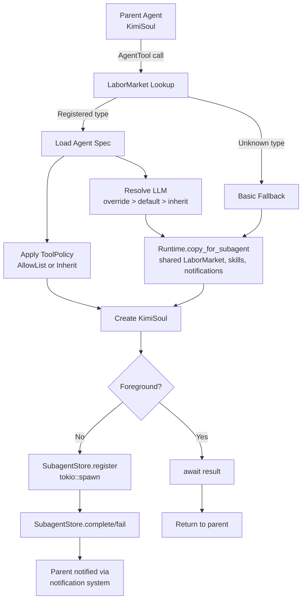

# Tour 6: The Workshop — Background Tasks & Subagents

> *"The basement is noisy. Sparks fly. Processes spawn. This is where the building does its heavy lifting while the upstairs guests enjoy tea."*

Welcome to the **Workshop** — the basement of Octopus-CLI. This is where long-running work happens **outside** the main conversation flow:
1. **Background Tasks** — shell commands that outlive the current turn
2. **Subagents** — secondary AI agents spawned for parallel work

These systems share a philosophy: **the main agent shouldn't wait.**

---

## 🔧 Part 1: Background Tasks

File: `octopus-cli/src/background/manager.rs` (~205 lines)

The `BackgroundTaskManager` is the workshop foreman. It tracks running processes and their output.

### The Data Structure

```rust
// File: octopus-cli/src/background/manager.rs
#[derive(Clone)]
pub struct BackgroundTaskManager {
    tasks: Arc<std::sync::Mutex<HashMap<String, TaskHandle>>>,
}

struct TaskHandle {
    task: BackgroundTask,
    child: Arc<Mutex<Child>>,          // The process
    output: Arc<Mutex<String>>,        // Captured stdout+stderr
}

#[derive(Debug, Clone)]
pub struct BackgroundTask {
    pub id: String,
    pub command: String,
    pub description: String,
    pub status: TaskStatus,
    pub output: String,
}
```

Notice the **three layers of Arc/Mutex**:
1. `Arc<std::sync::Mutex<HashMap<...>>>` — shared task registry
2. `Arc<Mutex<Child>>` — shared process handle
3. `Arc<Mutex<String>>` — shared output buffer

🐍 **Python's way:** `asyncio.Queue` + `asyncio.Lock` for shared state. Processes managed by `asyncio.create_subprocess_exec()`.

🦀 **Rust's way:** `Arc` for shared ownership, `tokio::sync::Mutex` for async-safe mutation, `std::sync::Mutex` for sync-safe mutation (the HashMap is only accessed briefly).

✨ **Where Rust shines:** **Mixed locking strategy.** The HashMap uses `std::sync::Mutex` (cheaper, no async overhead) because lock contention is brief. The Child and output use `tokio::sync::Mutex` because they're held across `.await` points. In Python, you'd use `asyncio.Lock` for everything — more uniform but less efficient.

### Spawning a Task

```rust
// File: octopus-cli/src/background/manager.rs
pub async fn spawn(&self, command: String, description: String) -> Result<String, String> {
    let id = uuid::Uuid::new_v4().to_string();

    let mut child = tokio::process::Command::new("bash")
        .arg("-c")
        .arg(&command)
        .stdout(Stdio::piped())
        .stderr(Stdio::piped())
        .stdin(Stdio::null())
        .spawn()
        .map_err(|e| format!("Failed to spawn: {}", e))?;

    let stdout = child.stdout.take().unwrap();
    let stderr = child.stderr.take().unwrap();
    let child = Arc::new(Mutex::new(child));
    let output = Arc::new(Mutex::new(String::new()));

    // Spawn reader tasks
    let output_clone = output.clone();
    tokio::spawn(async move {
        let mut reader = BufReader::new(stdout).lines();
        while let Ok(Some(line)) = reader.next_line().await {
            let mut out = output_clone.lock().await;
            out.push_str(&line);
            out.push('\n');
        }
    });

    // Store in registry
    self.tasks.lock().unwrap().insert(id.clone(), TaskHandle { ... });
    Ok(id)
}
```

When a task spawns:
1. A `tokio::process::Child` is created
2. **Two reader tasks** are spawned — one for stdout, one for stderr
3. Both append to a shared `Arc<Mutex<String>>`
4. The task handle is stored in the registry

🐍 **Python's way:** Similar, but Python's `asyncio.subprocess` has higher overhead per process.

🦀 **Rust's way:** `tokio::process::Child` is a thin wrapper around OS process handles. The reader tasks are green threads (cooperative scheduling), so 1,000 background tasks consume ~1MB of memory, not 50GB.

✨ **Where Rust shines:** **Tasks are cheaper than threads.** Each background reader is a `tokio::spawn` future — ~200 bytes of memory. In Python, each subprocess reader might need a thread (~8MB stack). Rust's async runtime handles I/O multiplexing for thousands of tasks on a single OS thread pool.

### Killing a Task

```rust
// File: octopus-cli/src/background/manager.rs
pub async fn stop(&self, id: &str) -> Result<(), String> {
    let child_arc = {
        let tasks = self.tasks.lock().unwrap();
        let handle = tasks.get(id).ok_or("Task not found")?;
        handle.child.clone()
    };  // Lock dropped here!

    let mut child = child_arc.lock().await;
    child.kill().await.map_err(|e| format!("Failed to kill: {}", e))?;

    let mut tasks = self.tasks.lock().unwrap();
    if let Some(handle) = tasks.get_mut(id) {
        handle.task.status = TaskStatus::Killed;
    }
    Ok(())
}
```

Notice the **careful lock discipline**:
1. Acquire `tasks` lock, clone the `Arc<Child>`, drop lock
2. `.await` on `child.kill()` — this might take time!
3. Re-acquire `tasks` lock to update status

This pattern avoids holding a sync mutex across an `.await` point, which would deadlock.

---

## 🧬 Part 2: Subagents

Files: `octopus-cli/src/tools/agent/mod.rs`, `octopus-cli/src/subagents/mod.rs`, `octopus-cli/src/soul/agent.rs`

A **subagent** is a recursive agent call — a second `KimiSoul` spawned to handle a sub-task. But unlike a naive recursion, the Rust implementation now has a full **type registry, policy enforcement, and runtime sharing** system.

### The Architecture



### The Type Registry: `LaborMarket`

```rust
// File: octopus-cli/src/subagents/mod.rs
#[derive(Debug, Clone)]
pub struct LaborMarket {
    types: Arc<Mutex<HashMap<String, AgentTypeDefinition>>>,
}

#[derive(Debug, Clone)]
pub struct AgentTypeDefinition {
    pub name: String,
    pub description: Option<String>,
    pub agent_file: PathBuf,        // Path to YAML spec
    pub when_to_use: Option<String>,
    pub default_model: Option<String>,
    pub tool_policy: ToolPolicy,
}
```

The `LaborMarket` is populated when an agent spec is loaded. Each `subagents:` entry in the YAML becomes a registered type:

```yaml
# agents/coder/agent.yaml
subagents:
  researcher:
    description: "Deep research on a topic"
    path: "agents/researcher/agent.yaml"
```

```rust
// In soul/agent.rs::load_agent()
for (subagent_name, subagent_spec) in spec.subagents {
    let builtin_spec = load_agent_spec(&subagent_spec.path)?;
    let tool_policy = if let Some(ref allowed) = builtin_spec.allowed_tools {
        ToolPolicy::AllowList {
            tools: allowed.iter().copied().map(Into::into).collect(),
        }
    } else {
        ToolPolicy::Inherit
    };
    runtime.labor_market.add_builtin_type(AgentTypeDefinition {
        name: subagent_name,
        description: Some(subagent_spec.description),
        agent_file: subagent_spec.path,
        when_to_use: builtin_spec.when_to_use,
        default_model: builtin_spec.model,
        tool_policy,
    });
}
```

### Policy Enforcement: What Can the Child Touch?

When a subagent spawns, its toolset is filtered by `ToolPolicy`:

```rust
// In KimiSoul::new()
if let Some(policy) = tool_policy {
    match policy {
        ToolPolicy::Inherit => {}
        ToolPolicy::AllowList { tools } => {
            toolset.hide_all_except(&tools);
        }
    }
}
```

- **`Inherit`** — child sees all tools the parent has (default)
- **`AllowList { tools }`** — child sees only the named tools (`Vec<ToolName>`)

This happens **after** all fallback tools are registered, so core tools like `Shell` and `TaskOutput` are also subject to the policy. Because `ToolPolicy::AllowList` carries `Vec<ToolName>` rather than bare strings, the policy is source-aware: it can distinguish a builtin `Shell` from an MCP tool of the same name.

✨ **Where Rust shines:** The `ToolPolicy` enum forces exhaustive handling. If you add a `DenyList` variant tomorrow, the compiler will point to every `match` that needs updating. In Python, a new policy mode might silently default to "allow all."

### Model Resolution: Whose Brain?

The child's LLM is resolved in priority order:

```rust
// File: octopus-cli/src/subagents/mod.rs
// User override from AgentTool call
let model_alias = params.model.as_deref()
    // Type default from agent spec
    .or(def.default_model.as_deref());

let subagent_llm = clone_llm_with_model_alias(
    parent_llm.as_ref(),
    &config,
    model_alias,
)?;
```

1. **`params.model`** — user explicitly requested a model (e.g., `"kimi-for-coding"`)
2. **`def.default_model`** — the agent spec defines a default (e.g., a researcher agent uses a cheaper model)
3. **Parent's LLM** — inherit whatever the parent is using

### Runtime Sharing: Not a Fresh Start

```rust
// File: octopus-cli/src/soul/agent.rs
pub fn copy_for_subagent(
    &self,
    session: Session,
    llm: Option<LLM>,
    approval: Approval,
    builtin_args: BuiltinSystemPromptArgs,
    subagent_type: Option<SubagentType>,
) -> Self {
    Self {
        config: self.config.clone(),
        oauth: OAuthManager::new(),     // Fresh OAuth (tokens are per-agent)
        llm,
        session,
        builtin_args,
        denwa_renji: self.denwa_renji.clone(),         // Shared
        approval,
        labor_market: self.labor_market.clone(),       // Shared
        environment: self.environment.clone(),
        notifications: self.notifications.clone(),     // Shared
        background_tasks: self.background_tasks.clone(), // Shared
        skills: self.skills.clone(),                   // Shared
        subagent_store: self.subagent_store.clone(),   // Shared
        // ... new wire hub, subagent_id, etc.
    }
}
```

The child agent **shares** the parent's `LaborMarket` (so it can spawn the same subagent types), `skills`, `notifications`, `background_tasks`, and `denwa_renji`. But it gets a **fresh** session, OAuth manager, and wire hub.

🐍 **Python's way:** Subagents get a fresh `AppRuntime` with empty registries. They can't spawn the same subagent types unless explicitly configured.

🦀 **Rust's way:** Selective sharing via `copy_for_subagent()`. The child is both isolated (fresh session) and connected (shared registries).

### Foreground vs. Background

```rust
// File: octopus-cli/src/tools/agent/mod.rs
// Foreground: parent waits
let result = run_subagent_with_market(
    parent_runtime,
    SubagentType::Known(KnownSubagentType::Coder),
    "Refactor this",
    None,
).await?;

// Background: parent continues, child is tracked
match params.execution_mode {
    ExecutionMode::Background => {
        tokio::spawn(async move {
            let result = run_subagent_with_market(
                parent_runtime,
                SubagentType::Known(KnownSubagentType::Coder),
                "Refactor this",
                None,
            ).await;
            // SubagentStore is updated automatically
        });
    }
    ExecutionMode::Foreground => { /* ... await result ... */ }
}
```

### The Ledger: `SubagentStore`

```rust
// File: octopus-cli/src/subagents/mod.rs
#[derive(Debug, Clone)]
pub struct SubagentStore {
    entries: Arc<Mutex<HashMap<String, SubagentEntry>>>,
}

pub struct SubagentEntry {
    pub id: String,           // Session ID
    pub description: String,
    pub subagent_type: SubagentType,
    pub status: SubagentStatus,  // Running | Completed | Failed
    pub result: Option<String>,
    pub created_at: DateTime<Utc>,
}
```

Every subagent (foreground or background) is registered in the `SubagentStore` when it starts and updated when it completes. Background subagents can be queried, listed, and their results retrieved.

---

## 🔌 Integration: How the Workshop Connects

Background tasks and subagents are triggered by tools:

```rust
// ShellTool spawns background tasks
ShellTool::call({ "command": "cargo build", "execution_mode": "background" })
    → BackgroundTaskManager::spawn()

// AgentTool spawns subagents
AgentTool::call({ "prompt": "Refactor this module" })
    → run_subagent() → new KimiSoul::run()
```

Both systems feed **back into the main agent** through:
- **Wire events** — real-time status updates
- **Notifications** — persistent delivery to LLM context
- **Tool results** — `TaskOutputTool` reads background output

---

## 🎁 Souvenir Shop: What to Remember

1. **Background tasks are OS processes + Tokio readers.** The process does the work; Tokio tasks capture output concurrently.
2. **Subagents are policy-enforced recursive souls.** `LaborMarket` registers types from YAML specs. `ToolPolicy` filters tools. Model override resolution follows user → spec → parent. Runtime sharing keeps the child connected to parent's registries.
3. **Lock discipline matters.** Never hold a `std::sync::Mutex` across `.await`. Clone the `Arc`, drop the lock, then await.
4. **Tasks are lightweight, processes are heavy.** 1,000 Tokio tasks = ~1MB. 1,000 OS processes = ~50GB. The workshop uses processes for isolation (shell commands) and tasks for I/O (readers).
5. **SubagentStore tracks every spawn.** Every subagent is registered on start and updated on completion. Background subagents are fully observable.

---

## 🚶 Next Stop

The Workshop handles heavy lifting in the basement. Now let's ascend to the **Front Desk** — where users actually interact with the building.

→ [Tour 7: The Front Desk](./07-front-desk.md)
